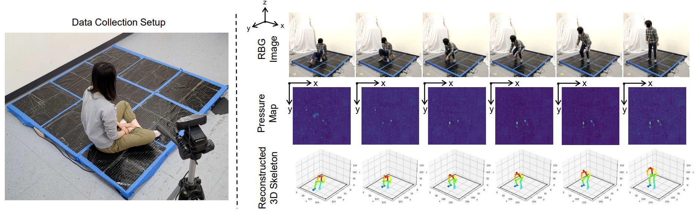

# IntelligentCarpet: Inferring 3D Human Pose from Tactile Signals

   

[Yiyue Luo](https://yyueluo.com/), [Yunzhu Li](http://people.csail.mit.edu/liyunzhu/), [Michael Foshey](https://www.csail.mit.edu/person/michael-foshey), [Wan Shou](https://showone90.wixsite.com/show), [Pratyusha Sharma](https://pratyushasharma.github.io/), [Tomás Palacios](http://www-mtl.mit.edu/wpmu/tpalacios/), [Antonio Torralba](https://groups.csail.mit.edu/vision/torralbalab/), and [Wojciech Matusik](https://cdfg.csail.mit.edu/wojciech)  

__CVPR 2021__ [\[Project Page\]]() [\[Paper\]]() [\[Video\]]()

## Dataset
Full training/validation dataset can be downloaded


## Quick Start
````
git clone https://github.com/yiyueluo/intelligentCarpet  
cd IntelligentCarpet   
conda env create -f environment.yml   
conda activate p36   
````

## Demo
Checkpoints and test dataset can be found here: https://www.dropbox.com/sh/5l0lm4po64xf6jd/AACuMt_oGy99Beyz_IMeknQ6a?dl=0

* __ckpts.zip__ contains the trained model
* __singlePerson_test.zip__ contains the test set for single person pose estimation 
* __singlePerson_test_diffTask.zip__ contains the test set for single person pose estimation, which is arranged by individual tasks (Note: use `sample_data_diffTask` to load data) 

Download the desired test set and unzip to its correspondng folder. 

```
python ./train/threeD_train_final.py
```

To visualize predictions, set `--exp_image` or `--exp_video`.     
To export L2 distance between predicted skeleton and groundtruth , set `--exp_L2`.   
To export data on tactile input, groundtruth keypoint, grondtruth heatmap, predicted keypoint, predicted heatmap, set `--exp_data`.  

Note: pay attention to the used checkpoints `--ckpts`, experiment path `--exp_dir` and test data path `--test_dir`.

## Contact
If you have any questions about the paper or the codebase, please feel free to contact yiyueluo@mit.edu.
